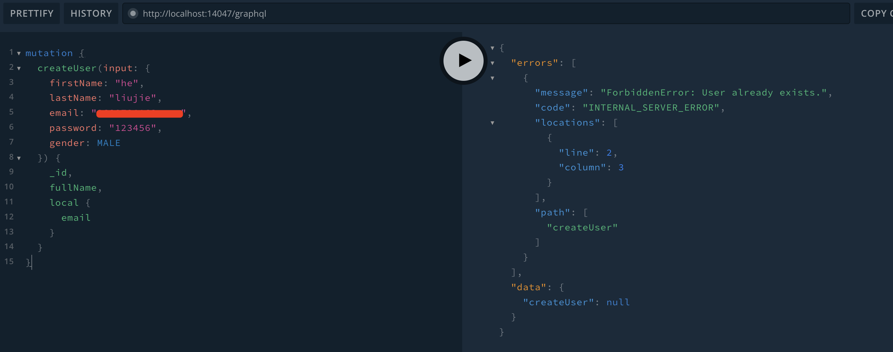
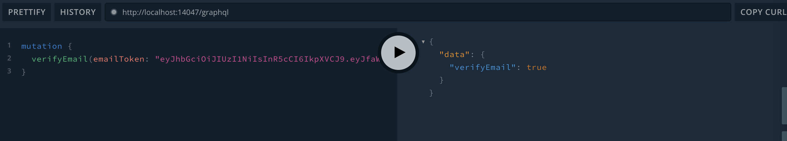

### Create User

The code defines a `Mutation` type in the GraphQL schema with a single `createUser` mutation that accepts a `CreateUserInput` input object and returns a User object. The @validate decorator from the `class-validator` library is used to validate the input object against a validation schema named "createUserRegister".

The `@rateLimit` decorator is used from the `graphql-rate-limit` library to limit the rate of requests for the `createUser` mutation to one request per five seconds, with a custom error message if the limit is exceeded.

The `createUser` mutation resolver function creates a new user by first checking if a user with the same email address already exists. If a user with the same email exists, a `ForbiddenError` is thrown. If a user with the same email address exists but has signed up with a social account, the user's local account is updated with the input password. If no user with the same email exists, a new user is created and saved to the database using TypeORM.

The `pubsub` and `req` objects are passed to the resolver function via the `@Context` decorator. The `pubsub` object is used to publish a `userCreated` event to subscribers, while the `req` object is used to retrieve the hostname and protocol for generating links.

The `createEmail` mutation resolver function creates a new email and saves it to the database using TypeORM.

The `sendMail` function is a utility function that sends an email using Nodemailer, a popular email library for Node.js. The function reads an HTML template file using the `fs` module and renders it using the `handlebars` templating engine. The function accepts various arguments, including the email type, the user object, the request object, a token, and an ID for tracking purposes.

