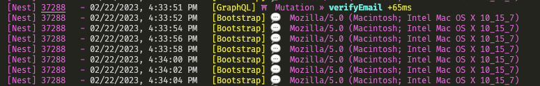
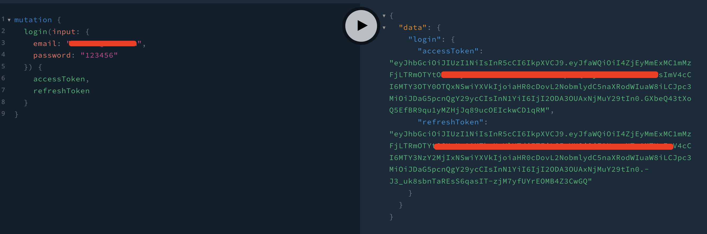
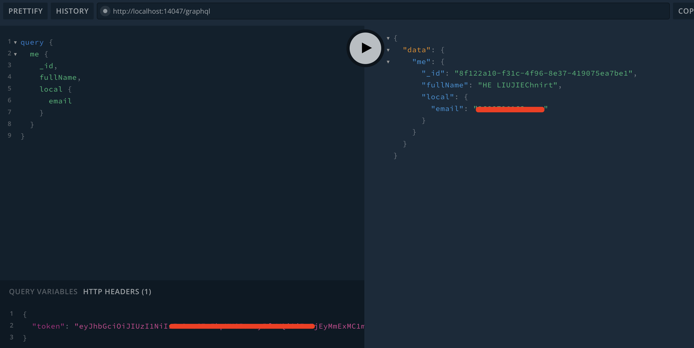
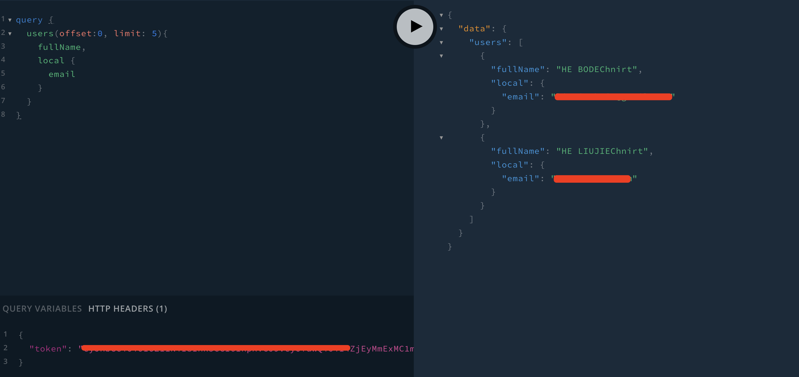

### Create User

The code defines a `Mutation` type in the GraphQL schema with a single `createUser` mutation that accepts a `CreateUserInput` input object and returns a User object. The @validate decorator from the `class-validator` library is used to validate the input object against a validation schema named "createUserRegister".

The `@rateLimit` decorator is used from the `graphql-rate-limit` library to limit the rate of requests for the `createUser` mutation to one request per five seconds, with a custom error message if the limit is exceeded.

The `createUser` mutation resolver function creates a new user by first checking if a user with the same email address already exists. If a user with the same email exists, a `ForbiddenError` is thrown. If a user with the same email address exists but has signed up with a social account, the user's local account is updated with the input password. If no user with the same email exists, a new user is created and saved to the database using TypeORM.

The `pubsub` and `req` objects are passed to the resolver function via the `@Context` decorator. The `pubsub` object is used to publish a `userCreated` event to subscribers, while the `req` object is used to retrieve the hostname and protocol for generating links.

The `createEmail` mutation resolver function creates a new email and saves it to the database using TypeORM.

The `sendMail` function is a utility function that sends an email using Nodemailer, a popular email library for Node.js. The function reads an HTML template file using the `fs` module and renders it using the `handlebars` templating engine. The function accepts various arguments, including the email type, the user object, the request object, a token, and an ID for tracking purposes.





### Login
```ts
# user.resolver.ts
@Mutation()
async login(@Args('input') input: LoginUserInput): Promise<LoginResponse> {
    const { email, password } = input

    const user = await getMongoRepository(User).findOne({
        where: {
            'local.email': email
        }
    })

    if (user && (await comparePassword(password, user.local.password))) {
        return await tradeToken(user)
    }

    throw new AuthenticationError('Login failed.')
}

# jwt/index.ts

export const generateToken = async (
	user: User,
	type: TokenType
): Promise<string> => {
	return await sign(
		{
			_id: user._id
		},
		common[type].privateKey,
		{
			issuer: ISSUER,
			subject: user.local
				? user.local.email
				: user.google
				? user.google.email
				: user.facebook.email,
			audience: AUDIENCE,
			algorithm: 'HS256',
			expiresIn: common[type].signOptions.expiresIn // 15m
		}
	)
}

export const tradeToken = async (user: User): Promise<LoginResponse> => {
	if (!user.isVerified) {
		throw new ForbiddenError('Please verify your email.')
	}

	if (!user.isActive) {
		throw new ForbiddenError("User already doesn't exist.")
	}

	if (user.isLocked) {
		throw new ForbiddenError('Your email has been locked.')
	}

	const accessToken = await generateToken(user, 'accessToken')
	const refreshToken = await generateToken(user, 'refreshToken')
 
	return { accessToken, refreshToken }
}
```
It takes in a `LoginUserInput` object as an argument, which has an email and password field. It uses the `getMongoRepository` function to retrieve the user from the database based on the email provided, and then checks if the provided password matches the stored password using the `comparePassword` function. If the user exists and the password is correct, it generates an access token and refresh token using the `tradeToken` function and returns a `LoginResponse` object with both tokens. If the login fails, an `AuthenticationError` is thrown.


The `generateToken` function takes in a user object and a token type (either "accessToken" or "refreshToken") and returns a signed JSON Web Token (JWT) string using the sign function from the `jsonwebtoken` library. The payload of the JWT includes the user's ID, and the subject field is set to the user's email address, depending on which authentication method was used. The `tradeToken` function takes in a user object and generates an access token and refresh token using the `generateToken` function. It then returns a `LoginResponse` object containing both tokens. Before generating the tokens, it checks if the user is verified, active, and not locked, and throws a `ForbiddenError` if any of these conditions are not met.




```ts
# user.resolver.ts
@Mutation()
async refreshToken(
    @Args('refreshToken') refreshToken: string
): Promise<RefreshTokenResponse> {
    const user = await verifyToken(refreshToken, 'refreshToken')

    const accessToken = await generateToken(user, 'accessToken')

    return { accessToken }
}
```

We use refresh tokens to maintain a user's authentication session even after their access token expires. Access tokens usually have a short lifespan (such as 15 minutes), after which they expire and require the user to authenticate again. By using a refresh token, the user can obtain a new access token without having to re-enter their credentials.

When a user logs in or refreshes their access token, we return both an access token and a refresh token in the response. The access token should be included in the headers of every request the user makes to protected routes on the server. When the access token expires, the user can use the refresh token to obtain a new access token.

To use the refresh token, the user must send a request to the server with the refresh token included in the request body. The server should then verify the refresh token, and if it is valid, return a new access token to the user. This process can be repeated until the refresh token expires or is revoked, at which point the user will need to authenticate again.

1. When the user logs in, the server responds with an access token and a refresh token.
2. The frontend application stores the access token in memory or local storage and sends it along with every request to the server that requires authentication.
3. When the access token expires, the server responds with a 401 Unauthorized error.
4.At this point, the frontend application detects the 401 error and sends a request to the server to refresh the access token using the refresh token.
5. If the refresh token is still valid, the server responds with a new access token and a new refresh token.
6. The frontend application stores the new access token and the new refresh token and retries the original request with the new access token.

### `@isAuthenticated`

```ts
# directives/auth.ts
import {
	SchemaDirectiveVisitor,
	AuthenticationError
} from 'apollo-server-express'
import { defaultFieldResolver, GraphQLField } from 'graphql'

class AuthDirective extends SchemaDirectiveVisitor {
	visitFieldDefinition(field: GraphQLField<any, any>) {
		const { resolve = defaultFieldResolver } = field

		field.resolve = function(...args) {
			const { currentUser } = args[2]

			if (!currentUser) {
				throw new AuthenticationError(
					'Authentication token is invalid, please try again.'
				)
			}

			return resolve.apply(this, args)
		}
	}
}

export default AuthDirective

# createGqlOptions
{
    schemaDirectives: {
        isAuthenticated: AuthDirective
    },
    context: async ({ req, res, connection }) => {
        if (connection) {
            const { currentUser } = connection.context

            return {
                pubsub,
                currentUser
            }
        }

        let currentUser

        // console.log(ACCESS_TOKEN, req.headers)

        const token = req.headers[ACCESS_TOKEN!] || ''

        // console.log('token', token)
        if (token) {
            currentUser = await verifyToken(token, 'accessToken')
        }

        // console.log(currentUser);

        return {
            req,
            res,
            pubsub,
            currentUser,
            trackErrors(errors) {
                // Track the errors
                // console.log(errors)
            }
        }
    },
}
```





This code defines an `AuthDirective` class that extends the `SchemaDirectiveVisitor` class from the `apollo-server-express` library. This directive is used to ensure that only authenticated users can access specific fields or operations in the GraphQL schema.

The `visitFieldDefinition` method of the `AuthDirective` class is called when the directive is used on a field in the schema. It overrides the resolver function of that field to add authentication checks.

The `context` function is used to set up the context object for each request. It first checks if the request is a subscription (i.e. a WebSocket connection) and if so, it extracts the `currentUser` object from the `connection.context` property.

For normal HTTP requests, it reads the access token from the `Authorization` header of the request and verifies it using the `verifyToken` function. If the token is valid, it sets the `currentUser` object in the context.

The `context` function also sets up a `trackErrors` function that can be used to log or handle errors that occur during the execution of the GraphQL operation.

By using this directive and context setup, the GraphQL server can ensure that only authenticated users can access certain fields or operations, and can retrieve the current user object from the access token for use in the resolvers.